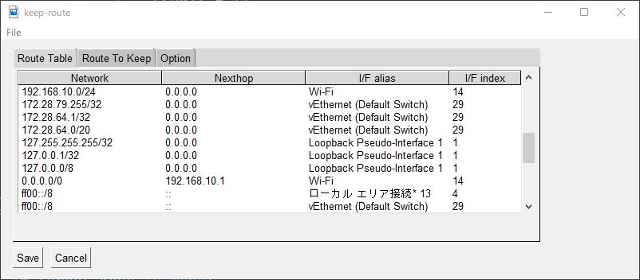
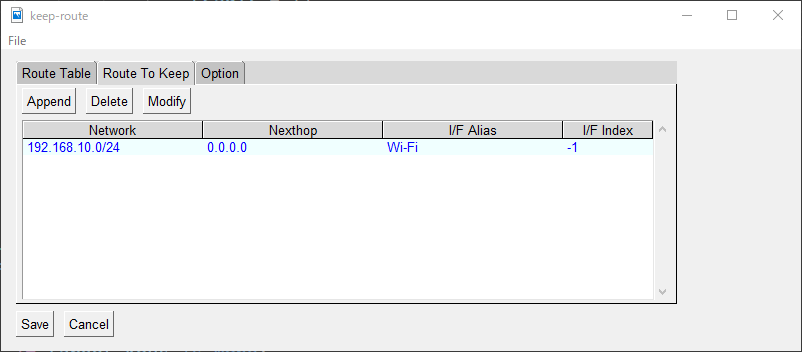

# keep-route
Keep route to specific networks on Windows.

##  What is keep-route?

Keep-route is an application to keep route to keep route to the specific networks,
if VPN applications chanege the routing table on your Windows OS.

This application processes following operations:

1. Watches the routing table on Windows OS.
2. Changes the routing table according to your route configuration.

## Screenshots

### Routing Table

### Route Config

### System Tray

## Installation

1. Download from [Release Page](https://github.com/otahi/keep-route/releases).
2. Unzip the file.
3. Put `keep-route.exe` into your favorite directory.
4. Run `keep-route.exe` with Administrator privillige.

Then you can see the icon on your system tray.
## Configurations

You can configure following items with GUI.
This application stores configuration in your APP_DATA directory.
(c:\\Users\\username\\AppData\\Roaming\\keep-route\\*.json)
### Routing Configurations

- Network Address
  - Network Address with Subnetmask
  - ex. 192.168.10.0/24, 172.16.1.20/32
- Nexthop
  - Nexthop for the Network Address
    - If no nexthop(direct connect), you can specify "0.0.0.0".
  - ex. 0.0.0.0, 172.16.0.254
- Interface Alias
  - Interface Alias on Windows OS
  - ex. Ethernet, Wi-Fi
- Interface Index
  - Interface Index on Windows OS(Optional)
  - ex. 11, 42

### Optional Configurations

- Interval
  - Interval for periodical watching in seconds
  - ex. 60, 300
## OS

This application is for Windows 10 or later.

## License

This application is licensed under the [MIT License](LICENSE).

This application uses following software.

| Name                      	| URL                                                 	| LICENSE                                                                                                                                                                                   	|
|---------------------------	|-----------------------------------------------------	|-------------------------------------------------------------------------------------------------------------------------------------------------------------------------------------------	|
| altgraph                  	| https://pypi.org/project/altgraph/                  	| MIT License                                                                                                                                                                               	|
| future                    	| https://pypi.org/project/future/                    	| MIT License                                                                                                                                                                               	|
| pefile                    	| https://pypi.org/project/pefile/                    	| MIT License                                                                                                                                                                               	|
| Pillow                    	| https://pypi.org/project/Pillow/                    	| Historical Permission Notice and Disclaimer                                                                                                                                               	|
| psgtray                   	| https://pypi.org/project/psgtray/                   	| GNU Lesser General Public License v3 or later                                                                                                                                             	|
| pyinstaller               	| https://pypi.org/project/pyinstaller/               	| GNU General Public License v2 (GPLv2) (GPLv2-or-later with a special   exception which allows to use PyInstaller to build and distribute non-free   programs (including commercial ones)) 	|
| pyinstaller-hooks-contrib 	| https://pypi.org/project/pyinstaller-hooks-contrib/ 	| Apache 2.0 Software License and GPL-2.0-or-later                                                                                                                                          	|
| PySimpleGUI               	| https://pypi.org/project/PySimpleGUI/               	| GNU Lesser General Public License v3 or later                                                                                                                                             	|
| pystray                   	| https://pypi.org/project/pystray/                   	| GNU Lesser General Public License v3                                                                                                                                                      	|
| pywin32-ctypes            	| https://pypi.org/project/pywin32-ctypes/            	| BSD                                                                                                                                                                                       	|
| six                       	| https://pypi.org/project/six/                       	| MIT License                                                                                                                                                                               	|